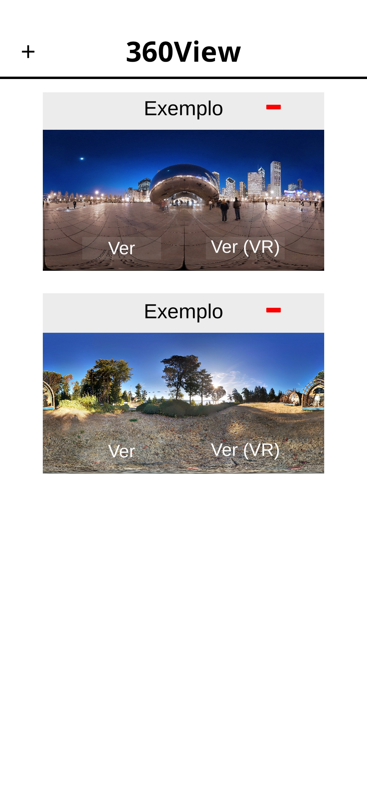
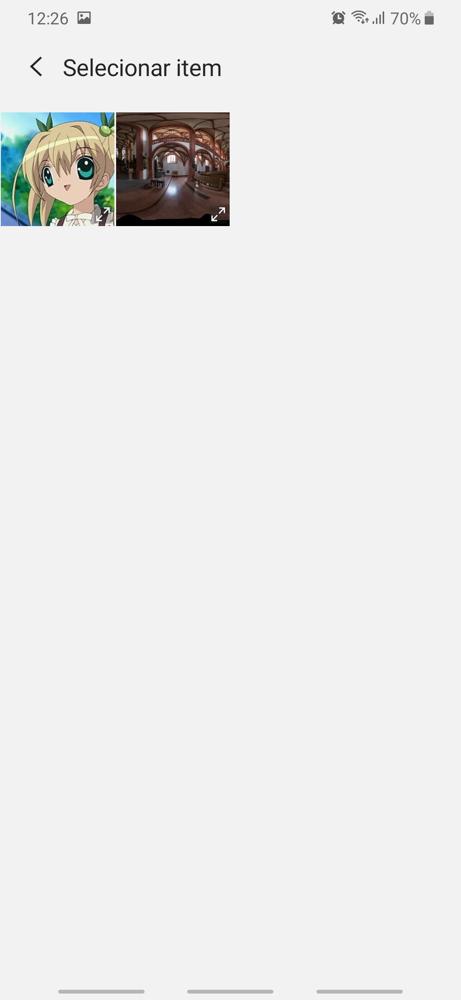
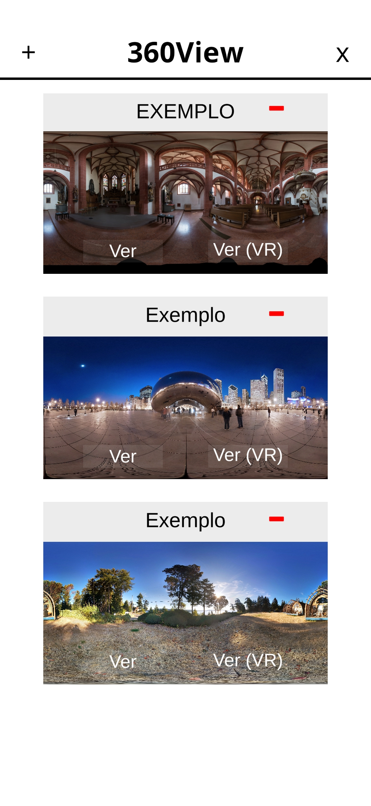
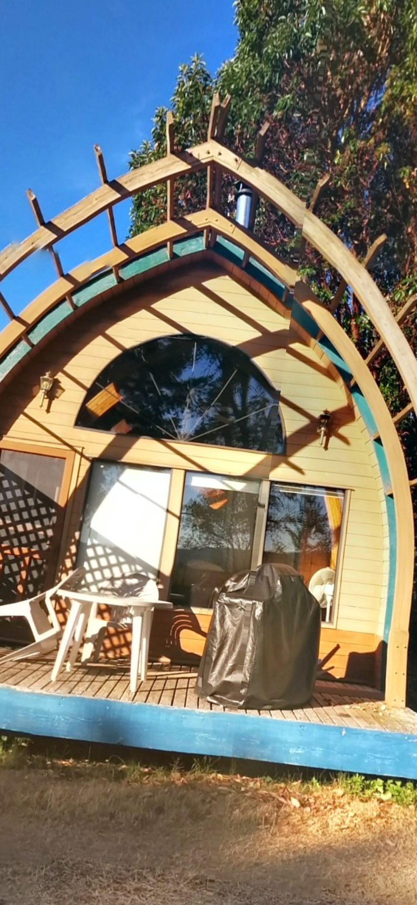
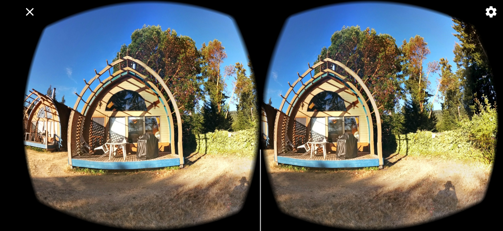

# 360View
### Descrição
Aplicação que demonstra recursos de visualização de imagens 360. **Testado apenas no Android.** 

### Recursos Utilizados
[Google VR for Unity](https://developers.google.com/vr/develop/unity/get-started-android): permite utilizar os recursos do Cardboard na Unity.

[Native File Browser](https://assetstore.unity.com/packages/tools/utilities/native-file-browser-68064): utilitário que simplifica a integração entre uma aplicação Unity e o sistema de arquivos dos dispositivos móveis.

### Uso
#### 1. Clicar na cruz para adicionar uma imagem da galeria

Por padrão, são adicionados dois items de exemplo. Você pode ignorar essa etapa e clicar em "Ver" (4.a) ou "Ver (VR)" (4.b) para visualizar os exemplos. 

#### 2. Selecionar uma imagem compatível na galeria

O programa utiliza imagens panorâmicas em projeção equirretangular, ou seja, uma imagem cuja largura é o dobro da altura e representa uma rotação de 360 graus.
Essa imagem é projetada em uma esfera. Observação importante: o método de projeção pode gerar distorções nos polos norte e sul da esfera. 

Na imagem de exemplo, o cenário é uma imagem compatível. 

A personagem de anime mal desenhada, no entanto, não é.

#### 3. Novo item adicionado

A partir daqui, poderemos visualizar qualquer item. 

Clique em "Ver" (4.a) para visualizar em modo normal utilizando o giroscópio do celular.

Clique em "Ver (VR)" (4.b) para visualizar em modo VR. É necessário um óculos especial, como o Google Cardboard, para isto.

#### 4.a Visualização padrão

Mova o celular para visualizar o cenário.

#### 4.b Visualização VR

Ajuste as lentes do aparelho e mova a cabeça para visualizar o cenário.

